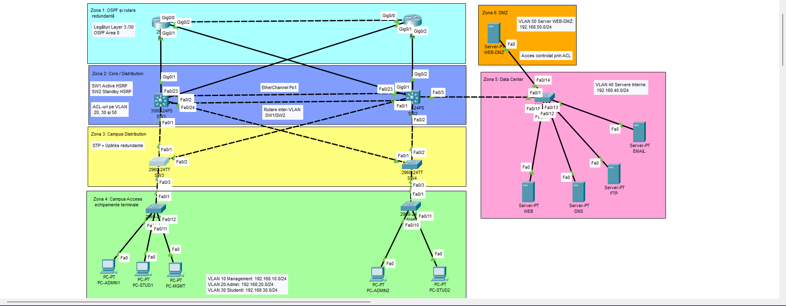
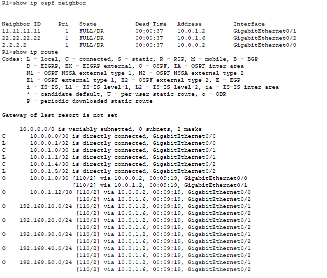
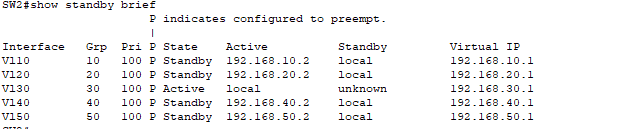
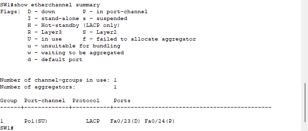
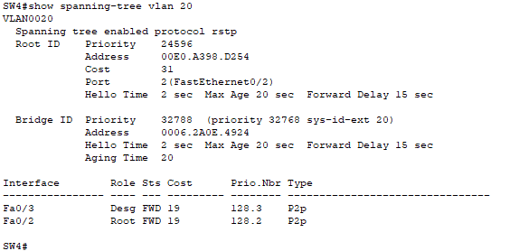
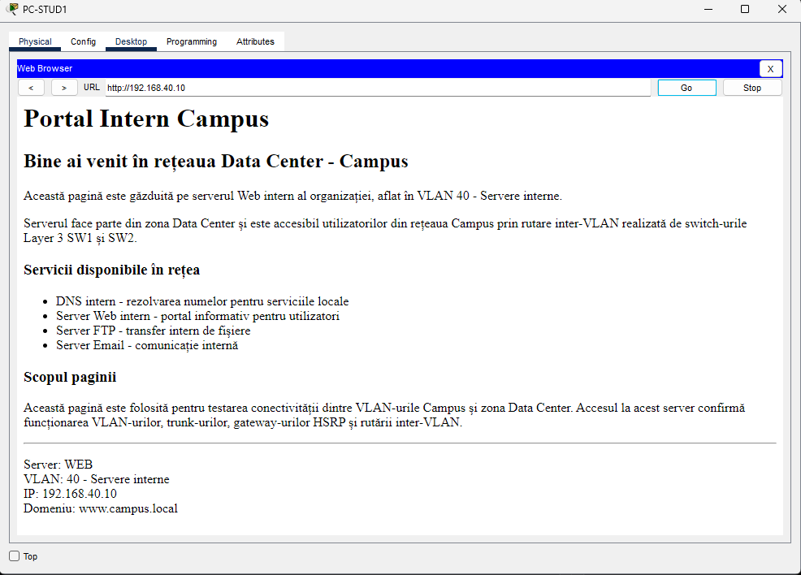
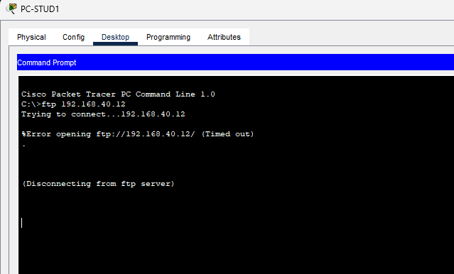

# Redundant Data Center–Campus Network

A redundant and segmented Data Center–Campus network designed and implemented in **Cisco Packet Tracer**, using dynamic routing, gateway redundancy, Layer 2 failover mechanisms, traffic filtering, and internal network services.

The project demonstrates the design, configuration, and validation of a small enterprise-style network using **VLANs, inter-VLAN routing, OSPF, HSRP, Rapid PVST+, LACP EtherChannel, ACLs, and DMZ segmentation**.



## Project Overview

The network is divided into functional areas representing a simplified enterprise infrastructure:

- **Routing Layer** – redundant Layer 3 connectivity using R1 and R2
- **Core / Distribution** – multilayer switches SW1 and SW2
- **Campus Distribution** – SW3 and SW4
- **Campus Access** – SW5 and SW6 with end-user devices
- **Data Center** – internal Web, DNS, FTP, and E-mail services
- **DMZ** – isolated Web service with controlled access

The design focuses on three main objectives:

1. **Segmentation** – separating users, management devices, servers, and the DMZ
2. **Availability** – maintaining connectivity when selected links or logical interfaces fail
3. **Access control** – allowing required services while restricting unauthorized traffic

> The topology implements redundancy primarily across the routing and core/distribution layers. It is not intended to represent a completely fault-tolerant production network with every component dual-homed.

## Technologies Implemented

| Technology | Purpose |
|---|---|
| VLANs | Logical separation of users, management devices, servers, and DMZ |
| 802.1Q Trunking | Transport of multiple VLANs between switches |
| Layer 3 Switching | Inter-VLAN routing through SW1 and SW2 |
| OSPF | Dynamic routing and alternative Layer 3 paths |
| HSRP | Redundant virtual default gateways |
| Rapid PVST+ | Layer 2 loop prevention and path reconvergence |
| EtherChannel / LACP | Aggregation and redundancy of physical switch links |
| Extended ACLs | Traffic filtering between VLANs and functional zones |
| DMZ | Isolation of a controlled Web service from internal servers |
| PortFast / BPDU Guard | Protection of access ports connected to end devices |
| DNS | Internal name resolution |
| HTTP | Internal and DMZ Web services |
| FTP | Internal file-transfer service |
| SMTP / POP3 | Internal E-mail service |

## VLAN and IP Addressing Plan

| VLAN | Name | Subnet | HSRP Gateway |
|---|---|---|---|
| 10 | Management | `192.168.10.0/24` | `192.168.10.1` |
| 20 | Admin | `192.168.20.0/24` | `192.168.20.1` |
| 30 | Students | `192.168.30.0/24` | `192.168.30.1` |
| 40 | Internal Servers | `192.168.40.0/24` | `192.168.40.1` |
| 50 | DMZ | `192.168.50.0/24` | `192.168.50.1` |

SW1 uses `.2` and SW2 uses `.3` on the corresponding VLAN SVIs.

The complete addressing scheme, including Layer 3 transit links and infrastructure management addresses, is available in [`docs/addressing-plan.md`](docs/addressing-plan.md).

## Routing Design

### Inter-VLAN Routing

SW1 and SW2 operate as Layer 3 switches and provide routing between the five VLANs through Switch Virtual Interfaces (SVIs).

Both switches participate in OSPF and advertise the VLAN networks into **OSPF area 0**.

### OSPF

OSPF process `1` is configured on:

| Device | Router ID |
|---|---|
| R1 | `1.1.1.1` |
| R2 | `2.2.2.2` |
| SW1 | `11.11.11.11` |
| SW2 | `22.22.22.22` |

On SW1 and SW2, OSPF uses `passive-interface default`, with adjacency formation explicitly enabled only on the routed uplinks.

Validation on R1 confirmed:
- OSPF neighbors in **FULL** state
- dynamically learned internal VLAN routes
- alternative equal-cost paths through the two Layer 3 core switches



## Redundancy and Fault Tolerance

### HSRP

SW1 and SW2 provide a common virtual gateway for each VLAN. SW1 is preferred Active using HSRP priority `110`, while SW2 operates as the backup gateway. `preempt` allows SW1 to reclaim the Active role after recovery.

A controlled failure was introduced on SW1 for VLAN 30. SW2 successfully transitioned to **Active** while retaining virtual gateway `192.168.30.1`.



### EtherChannel

Two physical FastEthernet links between SW1 and SW2 are grouped into `Port-channel1` using **LACP (`mode active`)**.

During testing, `Fa0/23` was disabled while `Fa0/24` remained operational. The logical port-channel remained active:
- `Fa0/23(D)` – failed member
- `Fa0/24(P)` – active bundled member
- `Po1(SU)` – port-channel remained in use



### Rapid PVST+

Rapid PVST+ is used to prevent Layer 2 loops while maintaining alternate paths.

For VLAN 20 on SW4, the normal state used `Fa0/1` as Root/Forwarding and `Fa0/2` as Alternate/Blocking. After disabling the primary uplink, Rapid STP reconverged and promoted `Fa0/2` to **Root/Forwarding**.



## Network Security

Extended ACLs are applied on the Layer 3 SVIs to control traffic between VLANs and functional zones.

### Student VLAN – VLAN 30

| Destination / Service | Policy |
|---|---|
| Management VLAN | Deny |
| DNS Server | Allow DNS |
| Internal Web Server | Allow HTTP / HTTPS |
| E-mail Server | Allow SMTP / POP3 |
| FTP Server | Deny |
| Other Internal Server Traffic | Deny |
| DMZ | Deny |

**Internal Web access allowed:**



**FTP access denied:**



### Admin VLAN – VLAN 20

Administrative users are allowed to access internal servers and the DMZ Web server over HTTP/HTTPS. Other traffic toward the DMZ is denied.

### DMZ – VLAN 50

The DMZ policy restricts communication initiated toward internal network segments while allowing specifically required traffic such as DNS resolution and established TCP responses where configured.

## Network Services

| Server | IP Address | Service |
|---|---|---|
| WEB | `192.168.40.10` | HTTP |
| DNS | `192.168.40.11` | DNS |
| FTP | `192.168.40.12` | FTP |
| EMAIL | `192.168.40.13` | SMTP / POP3 |
| WEB-DMZ | `192.168.50.10` | HTTP / HTTPS |

## Testing and Validation

| Test | Result |
|---|---|
| OSPF adjacency and dynamic route learning | PASS |
| HSRP gateway failover | PASS |
| EtherChannel member-link failure | PASS |
| Rapid STP uplink failover | PASS |
| Student VLAN → Internal Web | PASS |
| Student VLAN → FTP restriction | PASS |

Detailed procedures and observed results are available in [`docs/test-matrix.md`](docs/test-matrix.md).

## Repository Structure

```text
redundant-data-center-campus-network/
├── README.md
├── .gitignore
├── topology/
│   └── redundant-data-center-campus.pkt
├── configs/
│   ├── routers/
│   ├── core/
│   ├── distribution/
│   ├── access/
│   └── data-center/
├── docs/
│   ├── addressing-plan.md
│   ├── test-matrix.md
│   └── thesis-english.pdf
└── assets/
```

## How to Run the Project

1. Install **Cisco Packet Tracer**.
2. Download or clone this repository.
3. Open `topology/redundant-data-center-campus.pkt`.
4. Inspect the topology and device configurations in Packet Tracer, or review the exported running configurations in [`configs`](configs/).
5. Reproduce the validation scenarios described in [`docs/test-matrix.md`](docs/test-matrix.md).

## Skills Demonstrated

- hierarchical enterprise network design
- IPv4 subnetting and addressing
- VLAN segmentation and 802.1Q trunking
- Layer 3 switching and inter-VLAN routing
- dynamic routing with OSPF
- first-hop redundancy with HSRP
- Rapid PVST+ and Layer 2 failover
- LACP EtherChannel
- extended ACL design and traffic filtering
- DMZ segmentation
- PortFast and BPDU Guard
- DNS, HTTP, FTP, SMTP, and POP3 services
- Cisco IOS CLI configuration
- troubleshooting and failover testing
- technical documentation

## Limitations and Future Improvements

Possible future extensions include:
- dual-homing the Data Center switch to both core switches
- additional redundant access/distribution uplinks
- SSH-based device management
- centralized Syslog and SNMP monitoring
- DHCP services for client VLANs
- a dedicated firewall between internal and DMZ zones
- automated configuration parsing or validation using Python

## Documentation

A public English version of the Bachelor's thesis associated with this project is available at [`docs/thesis-english.pdf`](docs/thesis-english.pdf).

The project was originally developed as a **Bachelor's thesis in Telecommunications Systems at Politehnica University of Timișoara**.

## Author

**Anton-Alexandru Demian**

Bachelor's graduate in Telecommunications Systems
Politehnica University of Timișoara
